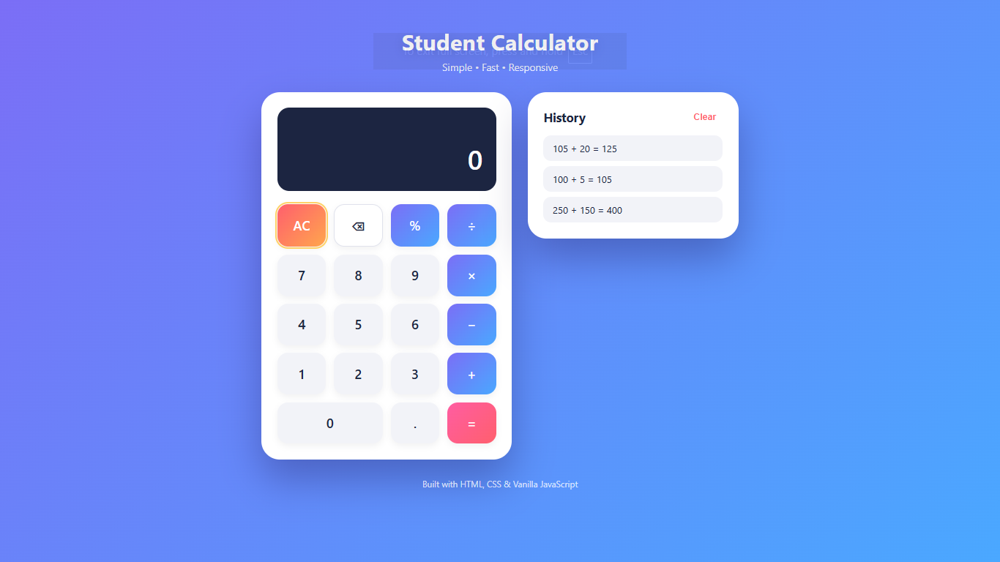

# 🧮 Student Calculator

A simple, modern, and responsive **Student Calculator** built using **HTML5, CSS3, and Vanilla JavaScript**.

The calculator provides essential arithmetic operations along with percentage calculation, decimal support, calculation history, keyboard controls, error handling, and a responsive user interface.

## ✨ Features

- ➕ Addition
- ➖ Subtraction
- ✖️ Multiplication
- ➗ Division
- 📊 Percentage calculation
- 🔢 Decimal calculations
- ⌫ Backspace functionality
- 🧹 AC (All Clear) functionality
- 📝 Calculation history
- 🗑️ Clear history
- ⌨️ Keyboard support
- 📱 Responsive design
- 🎨 Modern card-based UI
- ⚡ Smooth button animations
- ⚠️ Division-by-zero error handling
- 🛡️ Safe calculation logic
- 🚫 No `eval()` function used
- 📐 Standard mathematical operator precedence

## 🛠️ Technologies Used

- HTML5
- CSS3
- Vanilla JavaScript

## 📂 Project Structure

student-calculator/
│
├── index.html
├── style.css
├── script.js
├── calculator-preview.png
├── LICENSE
└── README.md

## 🧮 Calculator Operations

| Operation | Symbol |
|---|---|
| Addition | + |
| Subtraction | − |
| Multiplication | × |
| Division | ÷ |
| Percentage | % |
| Decimal | . |
| All Clear | AC |
| Backspace | ← |

## 📐 Multi-Operator Calculations

The calculator supports multiple operators within a single expression and follows standard mathematical precedence.

Example:

250 + 150 × 2 = 550

Another example:

10 + 20 × 3 − 5 = 65

Multiplication and division are calculated before addition and subtraction.

## ⌨️ Keyboard Support

The calculator can be operated using a keyboard.

| Keyboard Key | Function |
|---|---|
| 0–9 | Enter numbers |
| + | Addition |
| - | Subtraction |
| * | Multiplication |
| / | Division |
| % | Percentage |
| . | Decimal point |
| Enter / = | Calculate result |
| Backspace | Delete last digit |
| Escape | Clear calculator |

## 📝 Calculation History

Every completed calculation is automatically added to the History section.

Example:

250 + 150 × 2 = 550

100 ÷ 5 = 20

The newest calculation appears at the top of the history list.

The history can also be cleared using the **Clear** button.

## ⚠️ Error Handling

The calculator safely handles invalid calculations.

For example:

100 ÷ 0

will display:

Error

This prevents invalid mathematical operations from producing incorrect results.

## 🛡️ Safe Calculation Logic

This project does not use JavaScript's `eval()` function.

Instead, the calculator uses custom JavaScript functions to:

1. Read the expression
2. Separate numbers and operators
3. Process multiplication and division
4. Process addition and subtraction
5. Generate the final result
6. Display the result and store it in history

This makes the calculation logic easier to understand and explain during an interview.

## 🔢 Floating-Point Precision

JavaScript can sometimes produce unexpected floating-point results.

For example:

0.1 + 0.2

can internally produce:

0.30000000000000004

The calculator uses result rounding to display cleaner numerical results.

## 📱 Responsive Design

The interface is designed to work across:

- Desktop
- Laptop
- Tablet
- Mobile devices

The calculator and history panel automatically adjust their layout according to screen size.

## 📸 Project Preview

## 🚀 How to Run Locally

### Method 1: Open Directly

1. Download or clone this repository.
2. Open the project folder.
3. Double-click `index.html`.
4. The calculator will open in your default browser.

No installation or external dependencies are required.

### Method 2: Using VS Code

1. Open the project folder in Visual Studio Code.
2. Open `index.html`.
3. Run it using a browser or the Live Server extension.
4. Start using the calculator.

## 📥 Clone the Repository

To clone this project:

git clone https://github.com/aakashnath/student-calculator.git

Then move into the project directory:

cd student-calculator

Open `index.html` in your browser.

## 🎯 Project Objective

The objective of this project was to build a practical and responsive calculator while strengthening fundamental web development and JavaScript programming concepts.

The project demonstrates how HTML, CSS, and JavaScript can work together to create an interactive web application without using external frameworks or libraries.

## 📚 Learning Outcomes

Through this project, I practiced:

- Semantic HTML structure
- Modern CSS layout techniques
- Responsive web design
- CSS animations and transitions
- JavaScript DOM manipulation
- Event handling
- Keyboard event handling
- Application state management
- Mathematical expression processing
- Error handling
- Array manipulation
- Dynamic HTML element creation
- Writing JavaScript without external frameworks

## 🔮 Future Improvements

Possible future improvements include:

- 🌙 Dark mode
- 🧪 Scientific calculator mode
- 🧠 Advanced mathematical functions
- 💾 Persistent calculation history
- 📱 Progressive Web App support
- 🧮 Memory functions such as M+, M-, MR and MC
- 🎨 Additional themes
- 🔊 Optional voice input

## 📄 License

This project is licensed under the MIT License.

## 👨‍💻 Author

**Aakash Nath**

B.Tech in Information Technology

Government College of Engineering and Leather Technology, Kolkata

GitHub: https://github.com/aakashnath

## ⭐ Support

If you like this project, please give it a ⭐ on GitHub.

Your support is appreciated and motivates me to build more projects!

---

**Built with ❤️ using HTML, CSS & Vanilla JavaScript**
