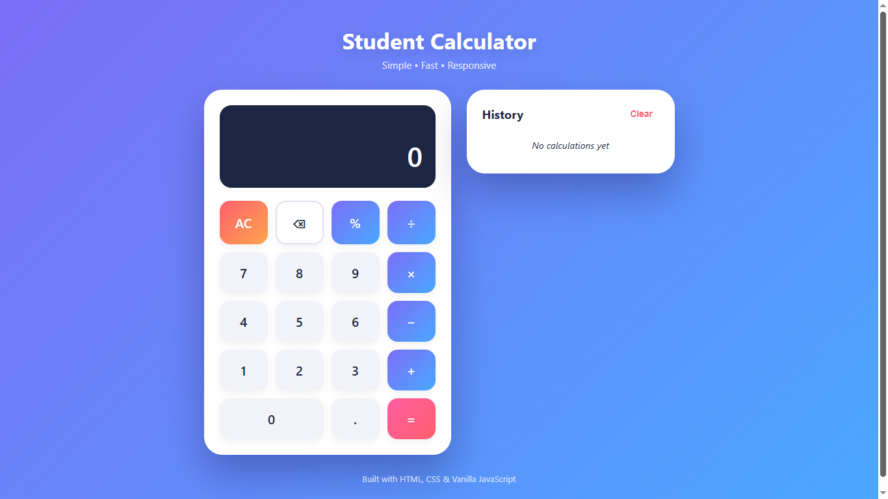
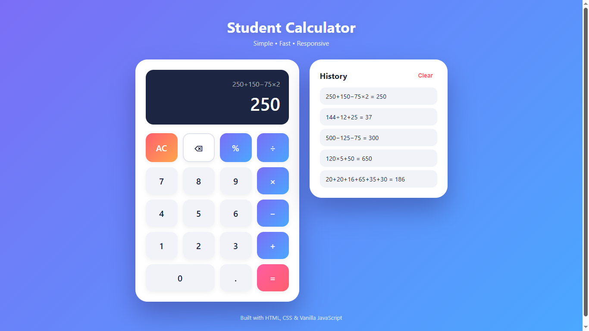

# 🧮 Student Calculator

A simple, modern, responsive, and user-friendly **Student Calculator** built using **HTML5, CSS3, and Vanilla JavaScript**.

It supports basic arithmetic operations, percentage calculations, decimals, calculation history, keyboard controls, error handling, and responsive design.

## ✨ Features

- ➕ Addition
- ➖ Subtraction
- ✖️ Multiplication
- ➗ Division
- 📊 Percentage calculation
- 🔢 Decimal support
- ⌫ Backspace
- 🧹 All Clear (AC)
- 📝 Calculation history
- 🗑️ Clear history
- ⌨️ Keyboard support
- 📱 Responsive design
- ⚡ Smooth button animations
- ⚠️ Division-by-zero handling
- 🛡️ Safe calculation logic
- 🚫 No `eval()` used
- 📐 Standard operator precedence
- 📸 Project screenshots

## 🛠️ Technologies

- HTML5
- CSS3
- Vanilla JavaScript

## 📂 Project Structure

student-calculator/
│
├── screenshots/
│   ├── calculator-clean.png
│   └── calculator-history.png
│
├── index.html
├── style.css
├── script.js
├── calculator-preview.png
├── LICENSE
└── README.md

## 🧮 Operations

| Operation | Symbol |
|---|---|
| Addition | + |
| Subtraction | − |
| Multiplication | × |
| Division | ÷ |
| Percentage | % |
| Decimal | . |
| Backspace | ← |
| All Clear | AC |
| Calculate | = |

## 📐 Operator Precedence

The calculator supports multiple operators and follows standard mathematical precedence.

Examples:

- `250 + 150 × 2 = 550`
- `10 + 20 × 3 − 5 = 65`
- `100 ÷ 5 + 20 = 40`

Multiplication and division are processed before addition and subtraction.

## ⌨️ Keyboard Support

| Key | Function |
|---|---|
| 0–9 | Enter numbers |
| + | Addition |
| - | Subtraction |
| * | Multiplication |
| / | Division |
| % | Percentage |
| . | Decimal |
| Enter / = | Calculate |
| Backspace | Delete |
| Escape | Clear |

## 📝 Calculation History

Completed calculations are automatically stored in the History section.

Example:

- `250 + 150 × 2 = 550`
- `100 ÷ 5 = 20`
- `25 + 75 = 100`

The latest calculation appears at the top, and the history can be cleared anytime.

## 🛡️ Safe Calculation Logic

The project does **not** use JavaScript's `eval()` function.

Custom JavaScript logic is used to:

1. Read the expression
2. Identify numbers and operators
3. Apply operator precedence
4. Calculate the result
5. Handle errors
6. Display and store the result

## ⚠️ Error Handling

Invalid operations such as division by zero are safely handled.

Example:

`100 ÷ 0 → Error`

## 📱 Responsive Design

The calculator works across:

- 💻 Desktop
- 💻 Laptop
- 📲 Tablet
- 📱 Mobile

The layout automatically adapts to different screen sizes.

## 📸 Screenshots

### Clean Calculator



### Calculator With History



### Project Preview


## 🚀 How to Run

### Directly

1. Clone or download the repository.
2. Open the project folder.
3. Open `index.html` in your browser.

### VS Code

1. Open the project in Visual Studio Code.
2. Open `index.html`.
3. Run it using a browser or Live Server.

No installation or external dependencies are required.

## 📥 Clone Repository

```bash
git clone https://github.com/aakashnath/student-calculator.git
cd student-calculator

Open `index.html` in your browser.

## 🎯 Project Objective

The objective of this project is to build a practical calculator while strengthening HTML, CSS, and JavaScript fundamentals.

It demonstrates DOM manipulation, event handling, keyboard controls, responsive design, mathematical expression processing, and error handling.

## 📚 Learning Outcomes

- HTML5 structure
- CSS3 styling and responsive design
- JavaScript DOM manipulation
- Event handling
- Keyboard event handling
- Operator precedence
- Calculation logic
- Error handling
- Dynamic history management
- Floating-point result handling
- Professional project organization

## 🔮 Future Improvements

- 🌙 Dark mode
- 🧪 Scientific calculator
- 💾 Local Storage history
- 🧮 Memory functions
- 🎨 Multiple themes
- 🔊 Voice input
- 📋 Copy result

## 📄 License

This project is licensed under the MIT License.

## 👨‍💻 Author

**Aakash Nath**

B.Tech in Information Technology  
Government College of Engineering and Leather Technology, Kolkata

GitHub: https://github.com/aakashnath

## ⭐ Support

If you like this project, please give it a ⭐ on GitHub.

---

**Built with ❤️ using HTML, CSS & Vanilla JavaScript**
